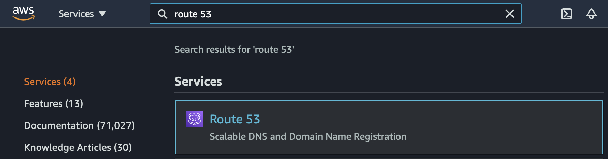
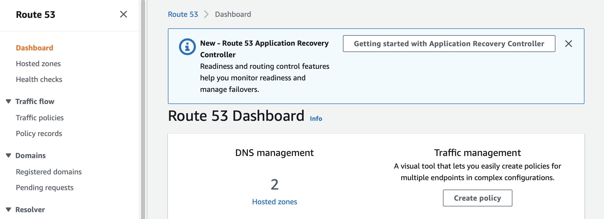
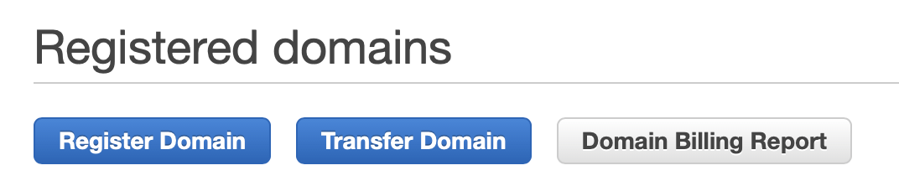
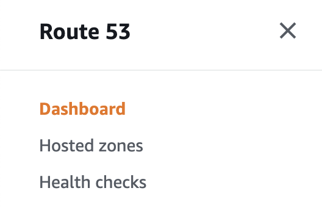
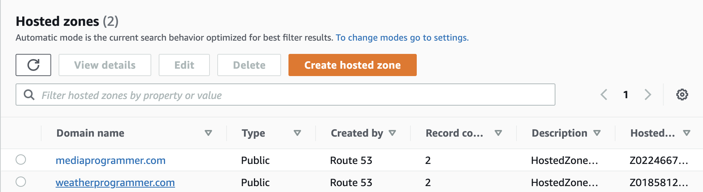
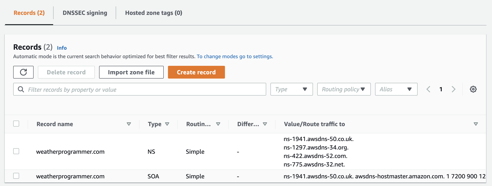
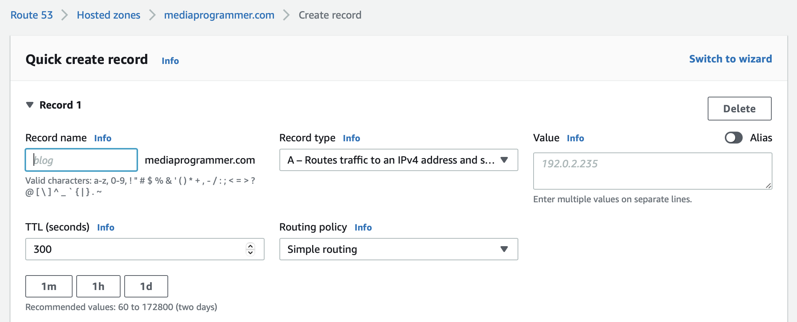
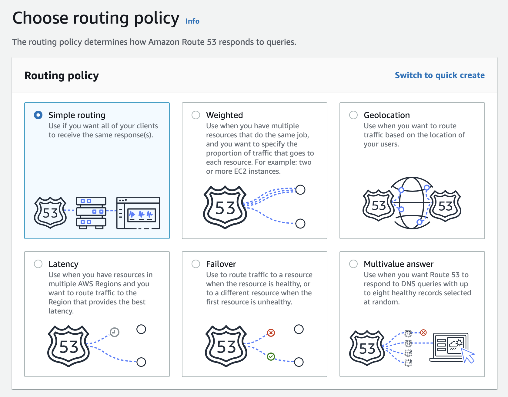
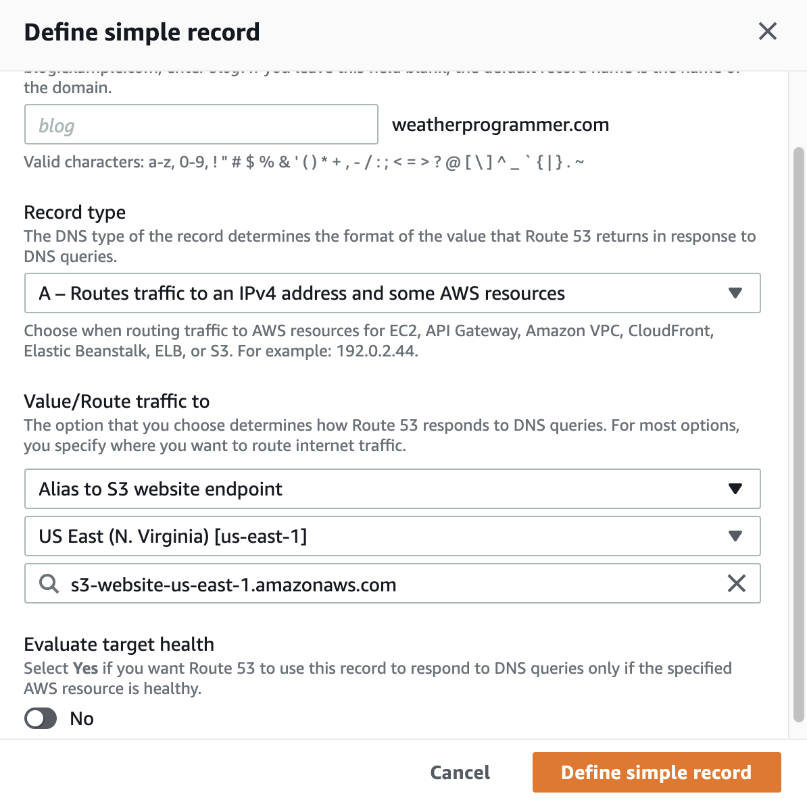
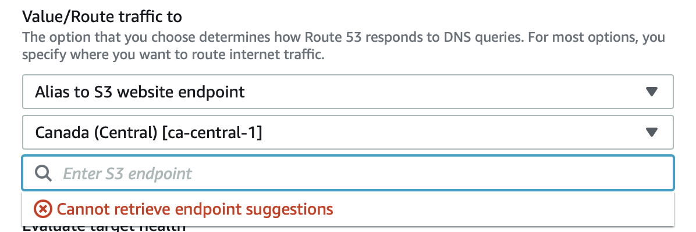

We set up a website in the last blog post. Here's what the URL looks like:

`http://whateveryourdomainis.com.s3-website-us-east-1.amazonaws.com`

And that may be all you need! I'm not here to judge. There's at least some chance you want your own domain name, though. How might you set that up? And how might you associate your Amazon bucket URL above to your own domain? 

We're going to use another Amazon web service, called **Route 53** to make this happen. 

## Route 53

1. Type that in and select from the Amazon console.

### Register a domain

2. On the left side, under **Domains**, click on **Registered domains**.

3. Click **Register Domain** if you want to spin up a new domain. Click **Transfer Domain** if move one over from another service. The screens are pretty straighforward, so I won't go too in-depth here. You need to make sure the domain you want is available, and then make the purchase. It may take several minutes for the domain to become active. After you've registered your domain, continue on to step 4.

 
### Setting up a DNS record

We now have a domain. Great! We need to create something called "records" that are tied to the domain. These records will point our domain to our S3 bucket website.

4. On the left side, click **Hosted Zones**.

5. Now click the domain name you want to wire up to your S3 bucket.

6. Click **Create Record**.

7. I prefer having my hand held. Sometimes. So I'm going to switch from the 'Quick create record' to the 'Wizard'. Look for the **Switch to wizard** link in the upper right.

8. Choose **Simple Routing**, then click **Next** in the lower right.

9. Click **Define Simple Record**.
10. You're brought to the screen where we're going to define something called an **A record**. What the heck is that? Basically, it enables you to point your newly-minted domain to an IP address or AWS resources. Well, our S3 website is an AWS resource. Perfect. This is what we've been waiting for. If you'd like, you can define a subdomain (for example, I could do **aws.weatherprogrammer.com** or **blog.weatherprogrammer.com** or whatever). I'm going to leave it blank, though, which means when someone hits **weatherprogrammer.com**, my A record will direct traffic to my S3 website.

In the **Value/Route traffic to** section, hit the dropdown and look for **Alias to S3 website endpoint**. It will then ask which region your bucket is in. Mine is in **US East (N. Virginia)**, but yours could be elsewhere. Refer to the S3 console (from Part 1 in this blog series) if you forgot.

Select the drop down and you should see your bucket there. Select it. You can select **Yes** or **No** to the **Evaluate target health** question. In my screenshot, I set it to **No** because I'll be doing this behind CloudFront in a future blog post. Click **Define simple record**.

11. Now your web site should be active. In my case, it's the one you're on right now, **weatherprogrammer.com**.

## Gotchas

There's a possibility you will see a message saying Route 53 **Canot retrieve endpoint suggestions**. Yikes. 

Why might this happen to you? A couple of common possibilities:

- You choose the wrong region (what I purposely did above)
- The name of your bucket doesn't match your domain (been there, done that)

Here's additional information from the AWS documentation, if you're interested:
https://docs.aws.amazon.com/Route53/latest/DeveloperGuide/troubleshooting-s3-bucket-website-hosting.html

## What's Next?

So, we have spun up our domain and pointed it at our S3 bucket. Cool. Here are some things we still have to do:

* ~~Register a domain name.~~
* ~~When we have that domain, set up an "A" record so that it routes traffic to the S3 web site above.~~
* Set up an SSL/TLS certificate. This is so we can have https in front of our web site.
* Set up a CloudFront distribution (i.e. implement a CDN on this web site) so that it's cached and you can deliver content to your users faster based on their physical location.