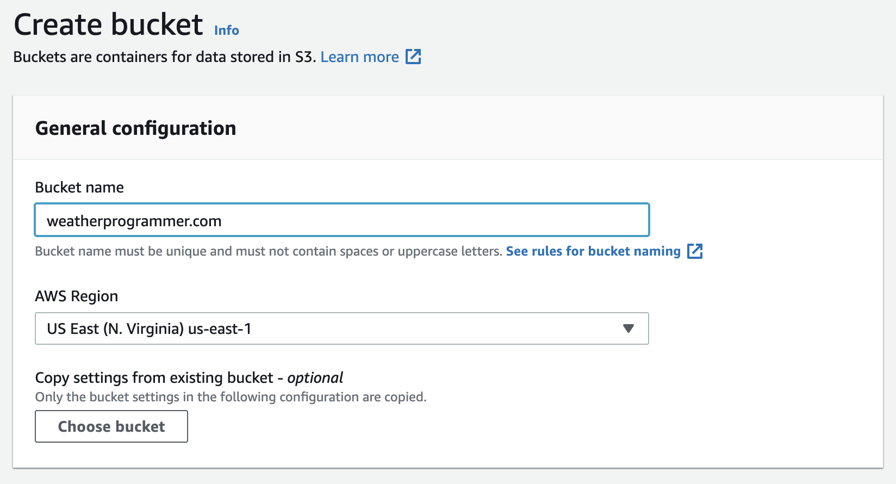

There are so many ways to build web sites and web applications nowadays. There are many hosting companies and
domain registrars and there can be a lot of configuration. How does one know if they're doing it "right"?

It depends on your skill level, how much time you want to invest, and how much you want to spend. There is no
one "right" way to do it. As with many things, the more you can do on your own, the lower the price point. 
It's going to cost me less to change my oil than it will sending my car to a mechanic. There is a knowledge cost
attached: if you don't know how to change the oil in your vehicle, you'll need to send it to someone who does.

I could spin up a physical web server (a computer) that
serves web pages and content. I could also do so in the cloud: starting instances (instances are virtual computers
in a data center somewhere), which eliminates the need to dedicate rack space or worry about replacing hardware
components that can occasionally fail. However, I need to consider the traffic hitting my server(s). Can my 
physical web server or instances in the cloud handle it? How much do I need to horizontally scale? (i.e. adding
more computers to handle heavy traffic to my web page.) Is the traffic somewhat evenly distributed between the
instances? There are ways to do these things in the cloud, but can you set up a web site even faster that
is still reliable? 

## Enter Amazon Web Services

<section style="display: flex; gap: 10px;">
  <div>
  Amazon offers a ton of web services. As of this blog post, they have more than <strong>200</strong> web services. I'm going to
  focus on 4:
  <ul>
    <li>Amazon S3 (Simple Storage Service)</li>
    <li>Route 53 (Domain Name Service)</li>
    <li>CloudFront (a global network of computers that cache your content for faster loading)</li>
    <li>Certificate Manager (where you deploy SSL/TLS certificates. It's how your web site uses HTTPS for encrypted data transfer)</li>
  </div>
  <div>
  <a href="https://aws.amazon.com/what-is-cloud-computing"></a>
  </div>
</section>

### Amazon S3

I've opted for an approach that strikes a middle ground: I'm using Amazon S3 (S3 stands for Simple Storage Service).
As the name implies, it's a place where you can store files. In S3 vernacular, files are called **objects**. Objects
are stored in something called a **bucket**. So, we're going to store the HTML, CSS, and JavaScript files (you'll 
hear me refer to these files as "static assets") inside of an Amazon S3 bucket.

#### Setting up an S3 Bucket

1. Navigate to [Amazon Web Services](https://aws.amazon.com "Amazon Web Services"). Sign up for an account if you don't already have one.
2. In the **search bar** at the top, type in **s3**. Look for "S3".


3. Click **Create Bucket**.


4. Give your bucket a name. For simplicity's sake, I am just using the name of my domain, but you can call it whatever you'd like. You also need to choose an **AWS Region**. I recommend the one closest to you. I live in Florida, so I'm choosing **US East (N. Virginia)**, but I could just as easily have chosen US East (Ohio).

**Note:** Bucket names must be globally unique. It's possible another AWS user has the bucket name you desire. If that's the case, choose another name. 



5. As you scroll down, you'll see other settings. We are going to unblock public access (otherwise, why would we have a web site, right?), but we'll do that later. At the very bottom of the page, click **Create Bucket**.

#### Configuring Bucket Permissions To Make It Public

6. You'll see your new bucket. **Click on it**.

7. Now, click **Permissions**.


8. Look for a section called **Block public access (bucket settings)**. Click **Edit**.


9. Uncheck **Block all public access** and click **Save changes**.

10. You'll be asked to confirm the settings, type **confirm** and click **Confirm**. Note: not all buckets are designed to be public-facing, but we're building a web site. In this case, we're sure we want to unblock the public access.

11. Scroll down. We need to define something called a bucket policy. Click **Edit**.

12. I'll save you some trouble. We want a policy that enables users that allows you to get -- or access -- the files. Remember, files are called objects in S3. So, we need a policy that enables users to get objects! You can copy/paste the code below, with **one important exception**. The part that says <strong>DOC-EXAMPLE-BUCKET/\*</strong> must be replaced with the name of your bucket. You must include the <strong>/*</strong> at the end of your bucket name.
```
{
  "Version":"2012-10-17",
  "Statement":[
    {
      "Sid":"PublicRead",
      "Effect":"Allow",
      "Principal": "*",
      "Action":["s3:GetObject","s3:GetObjectVersion"],
      "Resource":["arn:aws:s3:::DOC-EXAMPLE-BUCKET/*"]
    }
  ]
}
```

13. Click **Save changes** at the bottom.

#### Configure Web Site Hosting

14. You're back at your bucket screen. To recap, we've told S3 that we want our bucket to be public and that we want users to be able to read our objects (e.g. files like HTML, CSS, JavaScript, etc.) We now need to tell S3 that we intend to use our bucket to host a web site. No problem! To do this, click **Properties**.

15. Scroll down to the end of the page. You'll see a section called **Static website hosting**. Click **Edit**.


16. Set **Static website hosting** to **Enable**. Set the **Hosting type** to **Host a static website**. You can then specify your home page (index document), which I've set to **index.html** and you may optionally set an error page.


17. Click **Save changes**.

18. At the bottom of the page, you should see the website endpoint. We'll come back to this after we upload an HTML file.


19. OK! Let's get scroll back up to the top of the page, and select **Objects**.

20. Click **Upload** and then **Add files**.

21. Look for an **index.html** file on your hard drive. This can be the entry point to your web site. Click **Upload**.

22. Now return to that website endpoint in Step 18. Your web site is launched!

## What's Next?

Awesome! So, we have a web site. Here are some things we still have to do:

* Register a domain name. 
* When we have that domain, set up an "A" record so that it routes traffic to the S3 web site above.
* Set up an SSL/TLS certificate. This is so we can have https in front of our web site.
* Set up a CloudFront distribution (i.e. implement a CDN on this web site) so that it's cached and you can deliver content to your users faster based on their physical location.