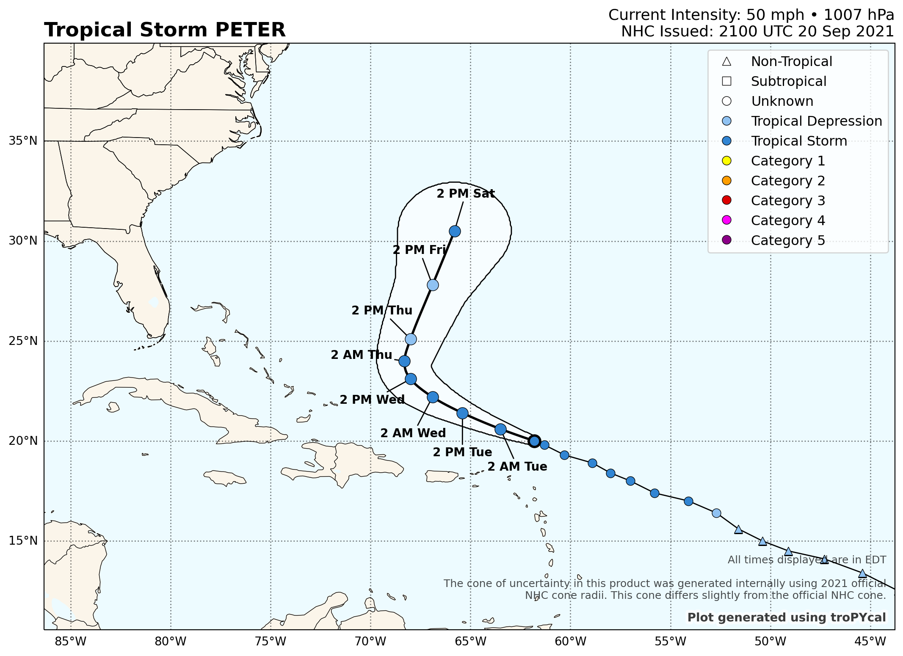
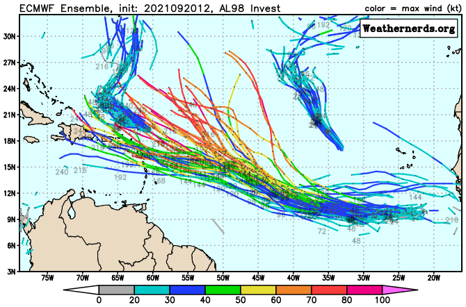
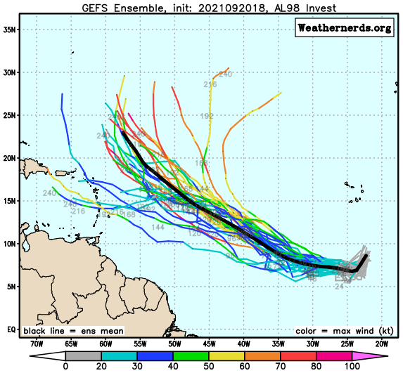

There are two tropical storms out there: Peter and Rose. They're both sheared cyclones
and they're both headed out into the open Atlantic. Admittedly, Peter may be an exception
since it could get reasonably close to Bermuda this upcoming weekend. Even if it does,
it's not likely to be a powerful system.

There is another system out there, Invest 98L, that is probably going to get cranking in
in two or three days. Its long-term track, believe it or not, will depend on
Peter, Rose, the remnant of Odette, and troughs within the mid-latitude westerlies that are 
over the central and western Pacific Ocean as I write this. Forecasting each of these "things"
independently would be extremely difficult. On top of that, there are interdependencies in
this chaotic system we call the atmosphere. So what I'm saying is the global model
forecasts are barely more than entertainment more than, say, 4 or 5 days into the future.

I would never disappoint your voracious appetite for knowledge, even if the outcome was
all but impossible to determine. The ECMWF ensemble has some members tracking 98L anywhere
from the central Caribbean to near 28N/50W in the middle of the Atlantic. I'd estimate that's
more than a 1000 mile spread in the ensemble membership. 

A similar spread shows up in the GFS ensemble, too, but its envelope is more to the east
of the ECMWF ensemble. This is not terribly surprising: the GFS tends to have a rightward
bias and the ECMWF is often more to the left. Not always, of course, but you get the idea.

The similarity between the two ensemble forecast systems is they
both forecast steady intensification, broadly speaking. Both ensemble suites also indicate
a sharp divergence in the member tracks by around Friday. It stems from the models' handling
of an anticyclonic wave breaking event south of Atlantic Canada and its possible interaction
with, yes, Tropical Storm Peter.
